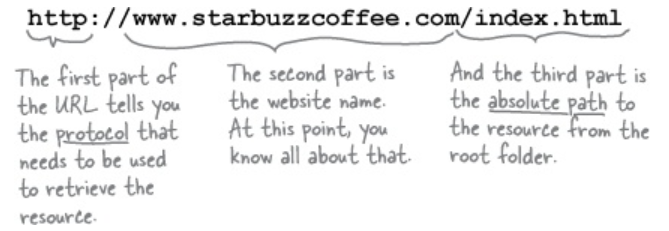

# Head First HTML and CSS, 2nd Edition

HT: Hypertext --> break free of a single page and link to other pages.
ML: Markup-language --> describe the structure of web pages.

## some useful elements

- \<q> --> short quote "
- \<blockquote> --> longer quotes
- block elements vs inline elements vs void elements
- a domain name: a unique name that is used to locate your site. --> website without www
- \<em> & \<strong>

- using # to access id attribute
- JPEG vs PNG vs GIF
- class attribute vs id attribute
  - \
 --> a class will allow you to style this paragraph independently of the other paragraphs. --> if you want to create a "group", so to speak, that you can style, just come up with a class, put your elements in it, and then you can style all the elements in that class together.
  - class: perform certain tasks for elements with the specified class name. In CSS using .
  - id: perform a certain task for a unique element. In CSS using #

### \<a>

- using the id attribute to create a destination for \<a>
- using target="\_blank" attribute in \<a> to open the website into new window

### \

- Images are stored on web servers right alongside HTML pages, so every image on the Web has its own URL, just like web pages do.
- using alt attribute in \ to indicate information of one used image if the image can't be loaded.
- adding width and height attributes into \ element to define the size of image
- background-color: white; background-image: url(); background-repeat: repeat-x
- background: white url() repeat-x

### css

- @font-face{}
- url() --> for linking to the source
- @media screen and
- @media print

### box

- padding-top: 0px; padding-right: 20px; padding-bottom: 30px; padding-left: 10px
- padding: 0px 20px 30px 10px;
- margin-top: 20px; margin-right: 20px; margin-bottom: 20px; margin-left: 20px
- margin: 20px
- margin-top: 0px; margin-right: 20px; margin-bottom: 0px; margin-left: 20px
- margin: 0px 20px;
- border-width: thin; border-style: solid; border-color: #007e7e;
- border: thin solid #007e7e;

### \
 & \

- using \
s to mark sections
- using \ to create a grouping of inline characters and elements

### font

- font: font-style font-variant font-weight font-size/line-height font-family
- font-stype: italic
- font-weight: bold

### Layout and Positioning

- when the browser is placing two inline elements next to each other --> margin1 + margin2
- when the browser is placing two block elements on top of each other --> max(margin1, margin2)
- clear: right --> no floating contentis allowed on the right of the element
- Types of layout
  - floating layout
  - Jello layout --> liquid and frozen
  - absolute layout
  - table display layout
- table display --> vertical-align: top, middle or bottom
