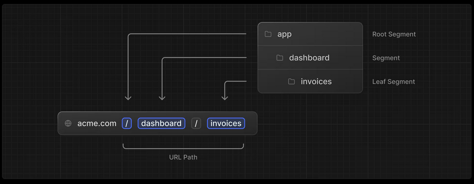

# Next related Tutorial

## React Foundations

### Building blocks of a web application

- User Interface
- Routing
- Data Fetching
- Rendering - when and where you render static or dynamic content
- Integrations
- Performance
- Scalability
- Developer Experience

### Rendering User Interfaces

- HTML renders to DOM (Document Object Model)

### Updating UI with Javascript

```html
<html>
  <body>
    <div id="app"></div>
    <script type="text/javascript">
      const app = document.getElementById("app");
      const header = document.createElement("h1");
      const text = "Develop. Preview. Ship.";
      const headerContent = document.createTextNode(text);
      header.appendChild(headerContent);
      app.appendChild(header);
    </script>
  </body>
</html>
```

#### Imperative vs Declarative programming

- Imperative: How to do something (step by step)
- Declarative: What to do (what you want to achieve)

```html
<html>
  <body>
    <div id="app"></div>
    <script src="https://unpkg.com/react@18/umd/react.development.js"></script>
    <script src="https://unpkg.com/react-dom@18/umd/react-dom.development.js"></script>
    <script src="https://unpkg.com/@babel/standalone/babel.min.js"></script>
    <!-- <script type="text/javascript">
      const app = document.getElementById("app");
      const header = document.createElement("h1");
      const text = "Develop. Preview. Ship.";
      const headerContent = document.createTextNode(text);
      header.appendChild(headerContent);
      app.appendChild(header); 
    </script> -->
    <script type="text/jsx">
      const app = document.getElementById("app");
      const root = ReactDOM.createRoot(app);
      root.render(<h1>Develop. Preview. Ship.</h1>);
    </script>
  </body>
</html>
```

### Building UI with Components

#### React core concepts

- Components: User interfaces can be broken down into smaller building blocks called components
  - React components should be **capitalized** to distinguish them from plain HTML and javascript
  - You use React components the same way you'd use regular HTML tags, with **angle brackets <>**

```html
<script type="text/jsx">
  const app = document.getElementById("app");
  function Header() {
    return (<h1>Develop. Preview. Ship.</h1>);
  }
  function HomePage() {
    return (
      <div>
        <Header />
        <p>Next.js is the React framework for production</p>
      </div>
    )
  }
  const root = ReactDOM.createRoot(app);
  root.render(<HomePage />);
</script>
```

- Props: you can pass pieces of information as properties to React components. These are called props. _props_ is an object, you can use object destructuring to explicitly name the values of props inside your function parameters. To use the props, you need to use **curly braces {}**.

```jsx
function HomePage() {
  const names = ["Ada Lovelace", "Grace Hopper", "Margaret Hamilton"];
  return (
    <div>
      <Header title="React" />
      <p>Next.js is the React framework for production</p>
      <Header />
      <ul>
        {names.map((name) => (
          <li key={name}>{name}</li>
        ))}
      </ul>
    </div>
  );
}
```

- State: React has a set of functions called hooks. Hooks allow you to add additional logic such as **state** to your components. You can think of state as any information in your UI that changes over time, usually triggered by user interaction.

```jsx
// count: state variable
// setCount: function to update the state variable
// default value: 0
const [count, setCount] = React.useState(0);
```

### Installing Next.js

- `npm install react@latest react-dom@latest next@latest` or `npx create-next-app@latest`
- by using the 1st commandline you create a new empty project. You need create _page.jsx_ and _app_ folder to make the _next_ app work.
- by 1st commandline you need also add `scripts": {"dev": "next dev"}` into your _package.json_ file.

### Server and Client Components

- the environments your application code can be executed in: the server and the client. The network boundary that separates server and client code.
- the client refers to the browser on a user's device that sends a request to a server for your application code. It then turns the response it receives from the server into an interface the user can interact with.
- the server refers to the computer in a data center that stores your application code, receives requests from a client, does some computation, and sends back an appropriate response.

#### Using Client Components

- Next.js uses Server Components by default.

## Nextjs App Router

- using _pnpm_ to install packages `npm install -g pnpm`
- `npx create-next-app@latest nextjs-dashboard" --use-pnpm`
- `pnpm i` to install the project's packages
- `pnpm dev` to start the development server
- `npm install --save clsx` a tiny utility for constructing className strings conditionally

### Optimizing Fonts and Images

- _Next.js_ automatically optimizes fonts in the application when you use the _next/font_ module.

```tsx
// fonts.ts
import { Inter } from "next/font/google";
export const inter = Inter({ subsets: ["latin"] });

// layout.tsx
import { inter } from "./fonts";
...
<body className={`${inter.className} antialiased`}>{children}</body>
```

- _next/image_ module prevents layout shift, resizing, lazy loading and serving images in modern formats like WebP and AVIF

### Creating Layouts and Pages

#### Nested routing

- _next.js_ uses file-system routing where folders are used to create nested routes. Each folder represents a route segment that maps to a URL segment. You can create separate UIs for each route using _layout.tsx_ and _page.tsx_ files.
  

### Navigating Between Pages

- in production, whenever _\<Link>_ components appear in the browser's viewport, Next.js automatically prefetches the code for the linked route in the background.

```tsx
import Link from "next/link";
// ...
export default function NavLinks() {
  return (
    <>
      {links.map((link) => {
        const LinkIcon = link.icon;
        return (
          <Link
            key={link.name}
            href={link.href}
            className="flex h-[48px] grow items-center justify-center gap-2 rounded-md bg-gray-50 p-3 text-sm font-medium hover:bg-sky-100 hover:text-blue-600 md:flex-none md:justify-start md:p-2 md:px-3"
          >
            <LinkIcon className="w-6" />
            <p className="hidden md:block">{link.name}</p>
          </Link>
        );
      })}
    </>
  );
}
```

- use _usePathname()_ hook to get the current active path (active links)

```tsx
"use client";

import {
  UserGroupIcon,
  HomeIcon,
  DocumentDuplicateIcon,
} from "@heroicons/react/24/outline";
import Link from "next/link";
import { usePathname } from "next/navigation";
import clsx from "clsx";

// ...

export default function NavLinks() {
  const pathname = usePathname();

  return (
    <>
      {links.map((link) => {
        const LinkIcon = link.icon;
        return (
          <Link
            key={link.name}
            href={link.href}
            className={clsx(
              "flex h-[48px] grow items-center justify-center gap-2 rounded-md bg-gray-50 p-3 text-sm font-medium hover:bg-sky-100 hover:text-blue-600 md:flex-none md:justify-start md:p-2 md:px-3",
              {
                "bg-sky-100 text-blue-600": pathname === link.href,
              }
            )}
          >
            <LinkIcon className="w-6" />
            <p className="hidden md:block">{link.name}</p>
          </Link>
        );
      })}
    </>
  );
}
```

### Fetching Data

#### API layer

- APIs are an intermediary layer between your application code and database. There are a few cases where you might use an API:
  - if you're using third-party services that provide an API
  - if you're fetching data from the client, you want to have an API layer that runs on the server to avoid exposing your database secrets to the client

#### Database queries

- when you're creating a full-stack application, you'll also need to write logic to interact with your database. There are a few cases where you have to write database queries:
  - when creating your API endpoints, you need to write logic to interact with your database
  - if you are using **REACT SERVER COMPONENTS**, you can skip the API layer and query your database directly without risking exposing your database secrets to the client

#### What are request waterfalls?

- A "waterfall" refers to a sequence of network requests that depend on the completion of previous requests. In the case of data fetching, each request can only begin once the previous request has returned data

#### Parallel data fetching

- A common way to avoid waterfalls is to initiate all data requests at the same time - in parallel
- In JavaScript, you can use the _Promise.all()_ or _Promise.allSettled()_ functions to initiate all promises at the same time

### Static and Dynamic Rendering

- static rendering: static rendering is useful for UI with **no data** or **data that is shared across users**, such as a static blog post or a product page. It might not be a good fit for a dashboard that has personalized data which is regularly updated.
- dynamic rendering: With dynamic rendering, content is rendered on the server for each user at **request time** (when the user visits the page). There are a couple of benefits of dynamic rendering:
  - **real-time data**: dynamic rendering allows your application to display real-time or frequently updated data.
  - **user-specific content**: it's easier to serve personalized content, such as dashboards or user profiles, and update he data based on user interaction.
  - **request time information**: dynamic rendering allows you to access information that can only be known at request time, such as cookies or the URL search parameters.

### Streaming

- streaming is a data transfer technique that allows you to break down a rounte into smaller "chunks" and progressively stream them from the server to the client as they become ready. By streaming, you can prevent slow data requests from blocking your whole page.
  This allows the user to see and interact with parts of the page without waiting for all the data to load before any UI can be shown to the user.
- you can add a _loading.tsx_ to contain a loading skeleton while the data is being fetched.

#### Route Groups

- route groups allow you to organize files into logical groups without affecting the URL path structure.
- file structure `/dashboard/(overview)/page.tsx` translates to URL path `/dashboard`

#### Streaming a component

- you can use **React Suspense** to specify a component. **Suspense** allows you to defer rendering parts of your application until some condition is met.

```tsx
<Suspense fallback={<LoadingSkeletion />}>
  <Component /> // Make component async
</Suspense>
```

### Partial Prerenderung

- Partial Prerenderung is only availbale with the Next.js canary release. `pnpm install next@canary`

```tsx
// next.config.mjs
import type { NextConfig } from "next";
const nextConfig: NextConfig = {
  experimental: {
    ppr: "incremental",
  },
};

// in your component
import SideNav form '@/app/ui/dashboard/sideNav';

export const experimental_ppr = true;
```

### Adding Search and Pagination

- `useSearchParams` - allows you to access the parameters of the current URL. For example, the search params for the URL `/dashboard?page=1&query=pending` would look like this: `{page: '1', query: 'pending'}`
- `usePathname` - lets you read the current URL's pathname. For example, for the route `/dashboard/invoice`, `usePathname` would return `/dashboard/invoice`
- `useRouter` - enables navigation between routes within client components programmatically.

```tsx
import { useSearchParams, usePathname, useRouter } from "next/navigation";

const searchParams = useSearchParams();
const pathname = usePathname();
const { replace } = useRouter();
...
const params = new URLSearchParams(searchParams);
replace(`${pathname}?${params.toString()}`);
```

- **Debouncing** is a programming practice that limits the rate at which a function can fire.

```tsx
pnpm i use-debounce

import { useDebouncedCallback } from "use-debounce";

const handleSearch = useDebouncedCallback((term) => {
  console.log(`Searching... ${term}`);

  const params = new URLSearchParams(searchParams);
  if (term) {
    params.set('query', term);
  } else {
    params.delete('query');
  }
  replace(`${pathname}?${params.toString()}`);
}, 300); // function will fire after 300ms
```

### Mutating Data

- React Server Actions allow you to run asynchronous code directly on the server. An advantage of invoking a Server Action within a Server Component is progressive enhancement - forms work even if JavaScript has not yet loaded on the client. For example, without slower internet connections.

```tsx
// Server Component
export default function Page() {
  // Action
  async function create(formData: FormData) {
    "use server";

    // Logic to mutate data...
  }

  // Invoke the action using the "action" attribute
  return <form action={create}>...</form>;
}
```

- You can do this with the `revalidatePath` function from `next/cache` to clear cache and trigger a new request to the server.

```tsx
"use server";

export async function createInvoice(formData: FormData) {
  const rawFormData = {
    customerId: formData.get("customerId"),
    amount: formData.get("amount"),
    status: formData.get("status"),
  };
  // Test it out:
  console.log(rawFormData);
  revalidatePath("/dashboard/invoices");
  redirect("/dashboard/invoices");
}
```

### Handling Errors

- you cann add `error.tsx` and `not-found.tsx` in folder

## SEO

### robots.txt

- a text file that tells search engine crawlers which pages or files the crawler can or can't request from your site. It's a way to control what search engines can and can't index on your site.

```txt
//robots.txt

# Block all crawlers for /accounts
User-agent: *
Disallow: /accounts

# Allow all crawlers
User-agent: *
Allow: /
```

---

## React

- React component starts with a capital letter.
- The `export default` keywords speficy the main component in the file.
- adding styles ``
- syntax:

  ```tsx
  // conditional rendering
  <>
    <div>{isLoggedIn ? <LogoutButton /> : <LoginButton />}</div>
    <div>{isLoggedIn && <AdminPanel />}</div>
  </>

  // redndering lists
  <>
    <ul>
      {numbers.map((number) => (
        <li key={number.toString()}>{number}</li>
      ))}
    </ul>
  </>

  // responding to events
  <button onClick={handleClick}>Click me</button>

  // updating the screen
  import { useState } from "react";
  function MyButton() {
    const [count, setCount] = useState(0);

    function handleClick() {
      setCount(count + 1);
    }

    return (
      <button onClick={handleClick}>
        Clicked {count} times
      </button>
    )
  }
  ```

### React Hooks

#### state hooks

- `useState` declares a state variable that you can update directly
- `useReducer` declares a state variable with the update logic insider a reducer function

  ```tsx
  import { useReducer } from "react";

  function reducer(state, action) {
    switch (action.type) {
      case "incremented_age": {
        return { name: state.name, age: state.age + 1 };
      }
      case "changed_name": {
        return { name: action.nextName, age: state.age };
      }
    }
    throw Error("Unknown action: " + action.type);
  }

  const initialState = { name: "Taylor", age: 25 };

  export default function Form() {
    const [state, dispatch] = useReducer(reducer, initialState);

    function handleButtonClick() {
      dispatch({ type: "incremented_age" });
    }

    function handleInputChange(e) {
      dispatch({ type: "changed_name", nextName: e.target.value });
    }

    return (
      <>
        <input value={state.name} onChange={handleInputChange} />
        <button onClick={handleButtonClick}>Increment age</button>
        <p>
          {state.name} is {state.age} years old
        </p>
      </>
    );
  }
  ```

#### context hooks

- `useContext` lets a component receive information from distant parents without passing it as props

  ```tsx
  import { createContext, useContext, useState } from "react";

  const ThemeContext = createContext("light");

  export default function MyApp() {
    const [theme, setTheme] = useState("light");

    return (
      <>
        <ThemeContext.Provider value={theme}>
          <Form />
        </ThemeContext.Provider>
        <Button
          onClick={() => {
            setTheme(theme === "dark" ? "light" : "dark");
          }}
        >
          Toggle theme
        </Button>
      </>
    );
  }

  function Form({ children }) {
    return (
      <Panel title="Welcome">
        <Button>Sign up</Button>
        <Button>Log in</Button>
      </Panel>
    );
  }

  function Panel({ title, children }) {
    const theme = useContext(ThemeContext);
    const className = "panel-" + theme;
    return (
      <section className={className}>
        <h1>{title}</h1>
        {children}
      </section>
    );
  }

  function Button({ children, onClick }) {
    const theme = useContext(ThemeContext);
    const className = "button-" + theme;
    return (
      <button className={className} onClick={onClick}>
        {children}
      </button>
    );
  }
  ```

#### ref hooks: _Refs_ let a component hold some information that isn't used for rendering. They are useful when you need to work with non-React systems, such as the built-in browser APIs

- `useRef` declares a ref

  ```tsx
  import { useState, useRef } from "react";

  export default function Stomwatch() {
    const [startTime, setStartTime] = useState(null);
    const [now, setNow] = useState(null);
    const intervalRef = useRef(null);

    function handleStart() {
      setStartTime(Date.now());
      setNow(Date.now());

      clearInterval(intervalRef.current);
      intervalRef.current = setInterval(() => {
        setNow(Date.now());
      }, 10);
    }

    function handleStop() {
      clearInterval(intervalRef.current);
    }

    let secondsPassed = 0;
    if (startTime != null && now != null) {
      secondsPassed = (now - startTime) / 1000;
    }

    return (
      <>
        <h1>Time passed: {secondsPassed.toFixed(3)} </h1>
        <button onClick={handleStart}>Start</button>
        <button onClick={handleStop}>Stop</button>
      </>
    );
  }
  ```

- `useImperativeHandle` lets you customize the ref exposed by your component

#### effect hooks

- `useEffect` connects a component to an external system. Effects are an "escape hatch" from the React paradigm and your Effect will re-run after every re-render of the component

```tsx
import { useState, useEffect } from "react";

export default function App() {
  const [position, setPosition] = useState({ x: 0, y: 0 });

  useEffect(() => {
    function handleMove(e) {
      setPosition({ x: e.clientX, y: e.clientY });
    }
    window.addEventListener("pointermove", handleMove);
    return () => {
      window.removeEventListener("pointermove", handleMove);
    };
  }, []);

  return (
    <div
      style={{
        position: "absolute",
        backgroundColor: "pink",
        borderRadius: "50%",
        opacity: 0.6,
        transform: `translate(${position.x}px, ${position.y}px)`,
        pointerEvents: "none",
        left: -20,
        top: -20,
        width: 40,
        height: 40,
      }}
    />
  );
}
```

- `useLayoutEffect` fires before the browser repaints the screen
- `useInsertionEffect` fires before React makes changes to the DOM

#### Performance hooks

To skip calculations and unnecessary re-rendering, use one of these hooks:

- `useMemo` lets you cache the result of an expensive calculation
- `useCallback` lets you cache a function definition before passing it down to an potimized component

To prioritize rendering, use one of these hooks:

- `useTransition` lets you mark a state transition as non-blocking and allow other updates to interrupt it
- `useDeferredValue` lets you defer updating a non-critical part of the UI and let other parts update first

## Next

### Introduction

- You can set cookies in _Server Actions_ or _Route Handlers_ using the _cookies_ function

  - _Server Actions_ are asynchronous functions that are executed on the server. They can be called in Server and Client Components to handle **form** submissions and **data mutations** in Next.js applications
  - Server actions can be invoked using the `action` attribute in a form element

  ```tsx
  // formData object for server action --> formData Object
  export default function Page() {
    async function createInvoice(formData: FormData) {
      "use server";
      const rawFormData = {
        customerId: formData.get("customerId"),
        amount: formData.get("amount"),
        status: formData.get("status"),
      };
      // logic
    }
    return <form action={createInvoice}>...</form>;
  }

  // passing additional arguments
  // client-component.tsx
  ("use client");

  import { updateUser } from "./actions";

  export function UserProfile({ userId }: { userId: string }) {
    const updateUserWithId = updateUser.bind(null, userId);

    return (
      <form action={updateUserWithId}>
        <input name="name" type="text" />
        <button type="submit">Update</button>
      </form>
    );
  }

  // actions.tsx
  ("use server");

  export async function updateUser(userId: string, formData: FormData) {}
  ```

- server actions are not limited to `<form>` and can be invoked from event handlers, `useEffect`, third-party libraries, and other form elements like `<button>`
- you can trigger a form submission programmatically using the `requestSubmit()` method. For example, when the user submits a form using the _ctrl_ + _enter_ keyboard shortcut, you can listen for the `onKeyDown` event

  ```tsx
  "use client";

  export function Entry() {
    const handleKeyDown = (e: React.KeyboardEvent<HTMLTextAreaElement>) => {
      if (
        (e.ctrlKey || e.metaKey) &&
        (e.key === "Enter" || e.key === "NumpadEnter")
      ) {
        e.preventDefault();
        e.currentTarget.form?.requestSubmit();
      }
    };

    return (
      <div>
        <textarea name="entry" rows={20} required onKeyDown={handleKeyDown} />
      </div>
    );
  }
  ```

- use `const [state, formAction] = useActionState(action_function, {message: ''})` and `const { pending } = useFormStatus()` together

### Layouts and Pages

- A **page** is UI that is rendered on a specific route.
- A **layout** is UI that is shared between multiple pages. On navigation, layouts preserve state, remain interactive, and do not rerender. It contains `{children}` prop.
- `[slug]` creates a special dynamic route segment used to generate multiple pages from data.

### Fetching Data

#### Server Component

```tsx
// With the fetch API
const data = await fetch("https://api...");
const posts = await data.json();
// With an ORM or database
const allPosts = await db.select().from(posts);
```

#### Client Component

```javascript
// You can use React's use hook to stream data from the server to client
// -- server side
import Posts from "@/app/ui/posts";
import { Suspense } from "react";

export default function Page() {
  // Don't await the data fetching function
  const posts = getPosts();

  return (
    <Suspense fallback={<div>Loading...</div>}>
      <Posts posts={posts} />
    </Suspense>
  );
}

// -- client side
'use client'
import { use } from 'react'

export default function Posts({ posts }) {
  const posts = use(posts)

  return (
    <ul>
      {posts.map((post) => (
        <li key={post.id}>{post.title}</li>
      ))}
    </ul>
  )
}
```

#### Streaming

- `dynamicIO` should be enabled in your application. The `dynamicIO` flag is an experimental feature in Next.js that causes data fetching operations in the App Router to be excluded from pre-renders unless they are explicitly cached.

```tsx
import type { NextConfig } from "next";
const nextConfig: NextConfig = {
  experimental: {
    dynamicIO: true,
  },
};

export default nextConfig;
```

- when using `async/await` in Server Components, Next.js will opt into **dynamic rendering**. This means the data will be fetched and rendered on the server for every user request. If there are any slow data requests, the whole route will be blocked from rendering- To improve the initial load time and user experience, you can use streaming to break up the page's HTML into smaller chunks and progressively send those chunks from the server to the client.

- There are two ways you can implement streaming in your application:

  - with the _loading.js_ file

  ```tsx
  // loading.js
  export default function Loading() {
    ...
    return <div>Loading...</div>;
  }

  // same as using the <Suspense> component
  <Suspense fallback={<Loading />}>
  ```

  - with the `<Suspense>` component

  ```tsx
  import { Suspense } from "react";
  import BlogList from "@/components/BlogList";
  import BlogListSkeleton from "@/components/BlogListSkeleton";

  export default function BlogPage() {
    return (
      <div>
        {/* This content will be sent to the client immediately */}
        <header>
          <h1>Welcome to the Blog</h1>
          <p>Read the latest posts below.</p>
        </header>
        <main>
          {/* Any content wrapped in a <Suspense> boundary will be streamed */}
          <Suspense fallback={<BlogListSkeleton />}>
            <BlogList />
          </Suspense>
        </main>
      </div>
    );
  }
  ```

### Updating Data

- usually steps to use server functions
  1. create a server function
  ```tsx
  "use server";
  export async function createPost(formData) {
    const title = formData.get("title");
    const content = formData.get("content");
  }
  ```
  2. create a form element or button `onClick`
  ```tsx
  export function Form() {
    return (
      <form action={createPost}>
        <input type="text" name="title" />
      </form>
    );
  }
  ```
  3. show a pending state
  ```tsx
  const [state, action, pending] = useActionState(createPost, {
    message: "Creating post...",
  });
  const { pending } = useFormStatus();
  ```
  4. revalidate the cache by using `revalidatePath()` or `revalidateTag()`
  5. redirect by needing to use `redirect()` function
### Error Handling

## Others

- to safely allow images from remote servers

  ```ts
  // next.config.js
  import { NextConfig } from "next";
  const config: NextConfig = {
    images: {
      remotePatterns: [
        {
          protocol: "https",
          hostname: "s3.amazonaws.com",
          port: "",
          pathname: "/my-bucket/**",
          search: "",
        },
      ],
    },
  };

  export default config;
  ```

- how to optimize fonts

  ```ts
  import { Geist } from "next/font/google";

  const geist = Geist({
    subsets: ["latin"],
  });

  export default function Layout({ children }: { children: React.ReactNode }) {
    return (
      <html lang="en" className={geist.className}>
        <body>{children}</body>
      </html>
    );
  }
  ```

// TODO: window function
// TODO: setInterval & clearInterval
// TODO: Promise
// TODO: JavaScript + React Datastructures
// TODO: events
