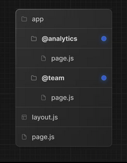
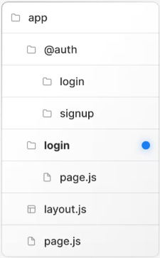
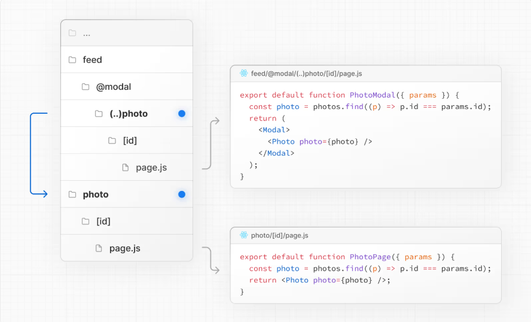

# Next related Tutorial

## React

## Next

### 1. Introduction

- You can set cookies in _Server Actions_ or _Route Handlers_ using the _cookies_ function

  - _Server Actions_ are asynchronous functions that are executed on the server. They can be called in Server and Client Components to handle **form** submissions and **data mutations** in Next.js applications
  - Server actions can be invoked using the `action` attribute in a form element

  ```tsx
  // formData object for server action --> formData Object
  export default function Page() {
    async function createInvoice(formData: FormData) {
      "use server";
      const rawFormData = {
        customerId: formData.get("customerId"),
        amount: formData.get("amount"),
        status: formData.get("status"),
      };
      // logic
    }
    return <form action={createInvoice}>...</form>;
  }

  // passing additional arguments
  // client-component.tsx
  ("use client");

  import { updateUser } from "./actions";

  export function UserProfile({ userId }: { userId: string }) {
    const updateUserWithId = updateUser.bind(null, userId);

    return (
      <form action={updateUserWithId}>
        <input name="name" type="text" />
        <button type="submit">Update</button>
      </form>
    );
  }

  // actions.tsx
  ("use server");

  export async function updateUser(userId: string, formData: FormData) {}
  ```

- server actions are not limited to `<form>` and can be invoked from event handlers, `useEffect`, third-party libraries, and other form elements like `<button>`
- you can trigger a form submission programmatically using the `requestSubmit()` method. For example, when the user submits a form using the _ctrl_ + _enter_ keyboard shortcut, you can listen for the `onKeyDown` event

  ```tsx
  "use client";

  export function Entry() {
    const handleKeyDown = (e: React.KeyboardEvent<HTMLTextAreaElement>) => {
      if (
        (e.ctrlKey || e.metaKey) &&
        (e.key === "Enter" || e.key === "NumpadEnter")
      ) {
        e.preventDefault();
        e.currentTarget.form?.requestSubmit();
      }
    };

    return (
      <div>
        <textarea name="entry" rows={20} required onKeyDown={handleKeyDown} />
      </div>
    );
  }
  ```

- use `const [state, formAction] = useActionState(action_function, {message: ''})` and `const { pending } = useFormStatus()` together

### 2. Routing

#### 2.1. Layouts and Pages

- A **page** is UI that is rendered on a specific route.
- A **layout** is UI that is shared between multiple pages. On navigation, layouts preserve state, remain interactive, and do not rerender. It contains `{children}` prop.
- `[slug]` creates a special dynamic route segment used to generate multiple pages from data.

#### 2.2. Linking and Navigating

- `<Link href="/">Home</Link>` is used to navigate between pages. It prefetches the linked page in the background when it appears in the viewport.
- `useRouter()` allows you to programmatically change routes from _Client Components_. Use `useRouter()` hook only if `<Link>` is not an option.

  ```tsx
  // scroll: scroll to top?
  // router.push(href: string, {scroll: boolean})
  // router.replace(href: string, {scroll: boolean})
  // router.refresh()
  // router.prefetch(href: string)
  // router.back()
  // router.forward()
  "use client";
  import { useRouter } from "next/navigation";

  export default function Page() {
    const router = useRouter();

    return (
      <button type="button" onClick={() => router.push("/dashboard")}>
        Dashboard
      </button>
    );
  }
  ```

- for _server components_, use the `redirect()` function instead
- next.js allows you to use the native `window.history.pushState` and `window.history.replaceState` methods to update the browser's history stack without reloading the page. `pushState` and `replaceState` calls integrate into the Next.js Router, allowing you to sync with `usePathname` and `useSearchParams`.

```tsx
// window.history.pushState
"use client";
import { useSearchParams } from "next/navigation";
export default function SortProducts() {
  const searchParams = useSearchParams();
  function updateSorting(sortOrder) {
    const params = new URLSearchParams(searchParams.toString());
    params.set("sort", sortOrder);
    window.history.pushState(null, "", `?${params.toString()}`);
  }
  return (
    <>
      <button onClick={() => updateSorting("asc")}>Sort Ascending</button>
      <button onClick={() => updateSorting("desc")}>Sort Descending</button>
    </>
  );
}
```

```tsx
// window.history.replaceState
"use client";
import { usePathname } from "next/navigation";
export function LocaleSwitcher() {
  const pathname = usePathname();

  function switchLocale(locale) {
    const newPath = `/${locale}${pathname}`;
    window.history.replaceState(null, "", newPath);
  }

  return (
    <>
      <button onClick={() => switchLocale("en")}>English</button>
      <button onClick={() => switchLocale("fr")}>French</button>
    </>
  );
}
```

#### 2.3. Error Handling

- Errors can be divided into two categories: _expected errors_ and _uncaught exceptions_
  - _Model expected errors as return values_: avoiding using `try/catch` for expected errors in Server Actions. Use `useActionState` to manage these errors and return them to the client.
  - _Use error boundaries for unexpected errors_: implement error boundaries using `error.tsx` and `global-error.tsx` files to handle unexpected errors and provide a fallback UI.
- Handling expected errors

  - Server Actions - `useActionState`

    ```tsx
    "use client";
    import { useActionState } from "react";
    import { createPost } from "./actions";

    const initialState = { message: "" };
    export function Form() {
      const [state, formAction, pending] = useActionState(createPost, initialState);

      return (
        <form action={formAction}>
        {state?.message && <p arial-live="polite">{state.message}</p>}
        <button disabled={pending}>
          {pending ? "Creating..." : "Create"}
        </form>
      )
    }
    ```

  - Server Components

    ```tsx
    // when fetching data inside of a Server Component, you can use the response to conditionally render an error message or redirect
    export default async function Page() {
      const res = await fetch("https://...");
      const data = await res.json();

      if (!res.ok) {
        return <p>{data.error}</p>;
      }
      return <p>{data.message}</p>;
    }
    ```

  - `notFound()` function with `not-found.js`

- Handling uncaught exceptions

  - Nested error boundaries

    ```tsx
    // create an error boundary by adding an error.js file inside a route segment and exporting a React component
    import { useEffect } from "react";
    export default function Error({ error, reset }) {
      useEffect(() => {
        console.error(error);
      }, [error]);
      return (
        <div>
          <h2>Something went wrong!</h2>
          <button onClick={() => reset()}>Try again</button>
        </div>
      );
    }
    ```

  - Global error in the root layout using the `global-error.js` file

#### 2.4. Loading UI and Streaming

- The special file _loading.js_ helps you create meaningful Loading UI with _React Suspense_.

  ```tsx
  // you can nest suspense
  import { Suspense } from "react";

  export default function ArtistPage({ artist }) {
    return (
      <>
        <h1>{artist.name}</h1>
        <Suspense fallback={<BigSpinner />}>
          <Biography artistId={artist.id} />
          <Suspense fallback={<AlbumsGlimmer />}>
            <h2>Something</h2>
          </Suspense>
        </Suspense>
      </>
    );
  }

  function BigSpinner() {
    return <h2>🌀 Loading...</h2>;
  }

  function AlbumsGlimmer() {
    return (
      <div className="glimmer-panel">
        <div className="glimmer-line" />
        <div className="glimmer-line" />
        <div className="glimmer-line" />
      </div>
    );
  }
  ```

- a common alternative UI pattern is to _defer_ updating the list and to keep showing the previous results until the new results are ready. The `useDeferredValue` Hook lets you pass a deferred version of the query down:

  ```tsx
  import { useDeferredValue } from "react";
  export default function App() {
    const [query, setQuery] = useState("");
    const deferredQuery = useDeferredValue(query, { timeoutMs: 2000 });

    return (
      <div
        style={{
          opacity: query !== deferredQuery ? 0.5 : 1,
        }}
      >
        <input
          type="text"
          value={query}
          onChange={(e) => setQuery(e.target.value)}
        />
        <SearchResults query={deferredQuery} />
      </div>
    );
  }
  ```

- `useTransition()` is a React Hook that lets you render a part of the UI in the background, in order to improve the user experience by allowing you to mark certain state updates as non-urgent transitions.
  ```tsx
  import { useState, useTransition } from "react";
  export default function App({}) {
    const [quantity, setQuantity] = useState(1);
    const [isPending, startTransition] = useTransition();
    const updateQuantityAction(async () => {
      const savedQuantity = await updateQuantity(newQuantity);
      startTransition(() => {
        setQuantity(savedQuantity);
      })
    })
  }
  return (
    <div>
      <h1>Checkout</h1>
      <Item action={updateQuantityAction}/>
      <hr />
      <Total quantity={quantity} isPending={isPending}>
    </div>
  )
  ```
- Streaming is particularly beneficial when you want to prevent long data requests from blocking the page from rendering as it can reduce the Time To First Byte and First Contentful Paint. It also helps improve Time to Interactive especially on slower devices.

#### 2.5. Redirecting

- the `redirect` function allows you to redirect the user to another URL. You can call `redirect` in _Server Components_, _Route Handlers_, and _Server Actions_.
- the `permanentRedirect` function allows you to permanently redirect the user to another URL. You can call `permanentRedirect` in _Server Components_, _Route Handlers_, and _Server Actions_.
- `useRouter()` hook for programmatically navigation
- `redirects` in _next.config.js_ allows you to redirect an incoming request path to a different path.
  ```tsx
  // next.config.js
  module.exports = {
    async redirects() {
      return [
        // Basic redirect
        {
          source: "/about",
          destination: "/",
          permanent: true,
        },
        // Wildcard path matching
        {
          source: "/blog/:slug",
          destination: "/news/:slug",
          permanent: true,
        },
      ];
    },
  };
  ```
- `NextResponse.redirect` in Middleware. Middleware allows you to run code before a request is completed. Then, based on the incoming request, redirect to a different URL using `NextResponse.redirect`. This is useful if you want to redirect users based on a condition (e.g., authentication, session management, etc) or have a large number of redirects.
  ```tsx
  // middleware runs after redirects in next.config.js and before rendering
  ```

#### 2.6. Route Groups

- a route group can be created by wrapping a folder's name in parenthesis: _(folderName)_.

#### 2.7. Dynamic Routes

- a dynamic segment can be created by wrapping a folder's name in square brackets: _[folderName]_. Dynamic Segements are passed as the params prop to _layout_, _page_, _route_, and _generateMetadata_ functions.
  ```jsx
  // app/blog/[slug]/page.jsx
  export default async function Page({ params }) {
    const { slug } = await params;
    return <div>My Post: {slug}</div>;
  }
  ```
- since the _params_ prop is a promise. You must use async/await or React's use function to access the values.
- The `generateStaticParams` function can be used in combination with dynamic route segments to statically generate routes at build time instead of on-demand at request time
  ```jsx
  // app/blog/[slug]/page.jsx
  export async function generateStaticParams() {
    const posts = await fetch("https://.../posts").then((res) => res.json());
    return posts.map((post) => ({
      slug: post.slug,
    }));
  }
  ```
- dynamic segments can be extended to **catch-all** subsequent segments by adding an ellipsis inside the brackets _[...folderName]_
- **catch-all** segments can be made optional by including the parameter in double square brackets: _[[...folderName]]_

  | route                         | example url | params                  | params Type       |
  | ----------------------------- | ----------- | ----------------------- | ----------------- |
  | app/shop/[...slug]/pages.js   | /shop/a     | {slug: ['a']}           | {slug: string[]}  |
  | app/shop/[...slug]/pages.js   | /shop/a/b   | {slug: ['a', 'b']}      | {slug: string[]}  |
  | app/shop/[...slug]/pages.js   | /shop/a/b/c | {slug: ['a', 'b', 'c']} | {slug: string[]}  |
  | app/shop/[[...slug]]/pages.js | /shop       | {slug: undefined}       | {slug?: string[]} |
  | app/shop/[[...slug]]/pages.js | /shop/a     | {slug: ['a']}           | {slug?: string[]} |
  | app/shop/[[...slug]]/pages.js | /shop/a/b   | {slug: ['a', 'b']}      | {slug?: string[]} |
  | app/shop/[[...slug]]/pages.js | /shop/a/b/c | {slug: ['a', 'b', 'c']} | {slug?: string[]} |

#### 2.8. Parallel Routes

- parallel routes allows you to simultaneously or conditionally render one or more pages within the same layout. They are useful for highly dynamic sections of an app, such as dashboards and feeds on social sites.
- parallel routes are created using named **slots**. Slots are defined with the _@folder_ convention.
  
- Slots are passed as props to the shared **parent** layout.

```jsx
// app/layout.jsx
export default function Layout({ children, team, analytics }) {
  return (
    <>
      {children}
      {team}
      {analytics}
    </>
  );
}
```

- you can define a _default.js_ file to render as a fallback for unmatched slots during the initial load or full-page reload

```jsx
// useSelectedLayoutSegment(s) to read the active route segment within a slot
"use client";
import { useSelectedLayoutSegment } from "next/navigation";
export default function Layout({ auth }) {
  const loginSegment = useSelectedLayoutSegment("auth");
}
```

- when a user navigates to `app/@auth/login` (or `/login` in the URL bar), `loginSegment` will be equal to the string _login_.
- use cases of parallel routes:
  - conditional routes
    ```jsx
    export default function Layout({ user, admin }) {
      const role = checkUserRole();
      return role === "admin" ? admin : user;
    }
    ```
  - tab groups
    ```jsx
    // app/@analytics/page-views/page.jsx
    // app/@analytics/visitors/page.jsx
    // app/@analytics/layout.jsx
    import Link from "next/link";
    export default function Layout({ children }) {
      return (
        <>
          <nav>
            <Link href="/page-views">Page Views</Link>
            <Link href="/visitors">Visitors</Link>
          </nav>
          <div>{children}</div>
        </>
      );
    }
    ```
  - modals
    
    - you can close the modal by calling `router.back()` or by using the `Link` component

#### 2.9. Interception Routes

- intercepting routes allows you to load a route from another part of your application within the current layout.

  - `(.)` to match segments on the **same level**
  - `(..)` to match segments **one level above**
  - `(..)(..)` to match segments **two levels above**
  - `(...)` to match segments from the **root** `app` directory

- use cases:
  - modals ([modal example](https://github.com/vercel/nextgram/tree/main/app))
    

#### 2.10. Route Handlers

- route handlers allow you to create custom request handlers for a given route using the Web Request and Response APIs.
- route handlers are defined in a `route.js` file inside the **app** directory

```jsx
// app/api/route.jsx --> extended NextRequest and NextResponse APIs
export async function GET(request) {}
```

#### 2.11. Middleware

- middleware allows you to run code before a request is completed. Then, based on the incoming request, you can modify the response by rewriting, redirecting, modifying the request or response headers, or responding directly.
- middleware runs before cached content and routes are matched.
- the `matcher` values need to be constants so they can be statically analyzed at build-time. Dynamic values such as variables will be ignored.

  ```jsx
  export const config = {
    matcher: [
      "/((?!api|_next/static|_next/image|favicon.ico|sitemap.xml|robots.txt).*)",
    ],
  };
  ```

  - configured matchers:
    - must start with `/`
    - can include named parameters: `/about/:path` matches `/about/a` and `/about/b` but not `/about/a/c`
    - `*` is zero or more, `?` is zero or one, `+` is one or more, thus `/about/:path*` matches `/about/a/b/c`

- `import {NextResponse} from 'next/server'`, which allows you to
  - `redirect` the incoming request to a different URL
  - `rewrite` the response by displaying a given URL
  - set request headers for API Routes, `getServerSideProps`, and `rewrite` destination
  - set response cookies and headers
- usecases:

  - setting cookies

  ```jsx
  import { NextResponse } from "next/server";

  export function middleware(request) {
    // Assume a "Cookie:nextjs=fast" header to be present on the incoming req
    // Getting cookies from the request using the "RequestCookies" API
    let cookie = request.cookies.get("nextjs");
    console.log(cookie); // => {name: 'nextjs', value: 'fast', Path: '/'}
    const allCookies = request.cookies.getAll();
    console.log(allCookies); // => [{name: 'nextjs', value: 'fast'}]

    request.cookies.has("nextjs"); // => true
    request.cookies.delete("nextjs");
    request.cookies.has("nextjs"); // => false

    // Setting cookies on the response using the "ResponseCookies" API
    const response = NextResponse.next();
    response.cookies.set("vercel", "fast");
    response.cookies.set({
      name: "vercel",
      value: "fast",
      path: "/",
    });
    cookie = response.cookies.get("vercel");
    console.log(cookie); // => {name: 'nextjs', value: 'fast', Path: '/'}
    // the outgoing response will have a "Set-Cookie:vercel=fast;path=/test" header
    return response;
  }
  ```

  - setting headers

  ```jsx
  import { NextResponse } from "next/server";

  export function middleware(request) {
    // clone the request headers and set a new header
    const requestHeaders = new Headers(request.headers);
    requestHeaders.set("x-hello-from-middleware", "hello");
    // you can also set request headers in NextResponse.next
    const response = NextResponse.next({
      request: { headers: requestHeaders },
    });
    // set a new response header
    response.headers.set("x-hello-from-middleware2", "hello");
    return response;
  }
  ```

  - CORS

  ```jsx
  import { NextResponse } from "next/server";

  const allowedOrigins = ["https://acme.com", "https://my-app.org"];
  const corsOptions = {
    "Access-Control-Allow-Methods": "GET, POST, PUT, DELETE, OPTIONS",
    "Access-Control-Allow-Headers": "Content-Type, Authorization",
  };

  export function middleware(request) {
    // check the origin from the request
    const origin = request.headers.get("origin") ?? "";
    const isAllowedOrigin = allowedOrigins.includes(origin);
    // handle preflighted requests
    const isPreflight = request.method === "OPTIONS";
    if (isPreflight) {
      const preflightHeaders = {
        ...(isAllowedOrigin && { "Access-Control-Allow-Origin": origin }),
        ...corsOptions,
      };
      return NextResponse.json({}, { headers: preflightHeaders });
    }
    const response = NextResponse.next();
    if (isAllowedOrigin) {
      response.headers.set("Access-Control-Allow-Origin", origin);
    }
    Object.entries(corsOptions).forEach(([key, value]) => {
      response.headers.set(key, value);
    });
    return response;
  }
  export const config = {
    matcher: "/api/:path*",
  };
  ```

  - Producing a Response

  ```jsx
  // the waitUntil() method takes a promise as an argument, and extends the lifetime of the Middleware until the promise settles
  // this is useful for performing work in the background
  import { NextResponse } from "next/server";
  export function middleware(request, event) {
    event.waitUntil(
      fetch("https://my-analytics-platform.com", {
        method: "POST",
        body: JSON.stringify({ pathname: request.nextUrl.pathname }),
      })
    );
    return NextResponse.next();
  }
  ```

#### 2.12. Internationalization

- Next.js enables you to configure the routing and rendering of content to support multiple languages.

### 3. Data Fetching

#### 3.1. Data Fetching and Caching

- to prevent the page from prerendering, you can add the following to your file: `export const dynamic = 'force-dynamic'`
- we recommend first attempting to fetch data on the server-side

```jsx
// you can use the unstable_cache API to cache the response when running next build
import { unstable_cache } from "next/cache";
import { db, posts } from "@/lib/db";

const getPosts = unstable_cache(
  async () => {
    return await db.select().from(posts);
  },
  ["posts"],
  { revalidate: 3600, tags: ["posts"] }
);
// this example caches the result of the database query for 1 hour.
```

- if you are using `fetch`, requests can be memoized by adding `cache: 'force-cache'`.

```jsx
import { cache } from "react";
import { db, posts, eq } from "@/lib/db";
import { notFound } from "next/nagivation";

export const getPost = cache(async (id) => {
  const post = await db.query.posts.findFirst({
    where: eq(posts.id, parseInt(id)),
  });
  if (!post) notFound();
  return post;
});
```

- sequential vs parallel data fetching
  - if you have nested components, and each component fetches its own data, then data fetching will happen sequentially if those data requests are not memoized.
  - by default, layout and page segments are rendered in parallel. However, due to the nature of `async/await`, an awaited request inside the same segment or component will block any requests below it. To fetch data in parallel, you can eagerly initiate requests by defining them outside the components taht use the data by adding `Promise.all`
  ```jsx
  export default async function Page({ params }) {
    const { username } = await params;
    const artistData = getArtist(username);
    const albumsData = getAlbums(username);
    const [artist, albums] = await Promise.all([artistData, albumsData]);
    return (
      <>
        <h1>{artist.name}</h1>
        <Albums list={albums} />
      </>
    );
  }
  ```
- using react `cache` and `server-only` with the preload pattern to guarantee that this data fetching only happens on the server
- preventing sensitive data from being exposed to the client
  - we recommend using React's taint APIs, `taintObjectReference` and `taintUniqueValue`, to prevent whole object instances or sensitive values from being passed to the client
  ```jsx
  // next.config.js
  module.exports = {
    experimental: {
      taint: true,
    },
  };
  import { queryDataFromDB } from "./api";
  import {
    experimental_taintObjectReference,
    experimental_taintUniqueValue,
  } from "react";
  export async function getUserData() {
    const data = await queryDataFromDB();
    experimental_taintObjectReference(
      "Do not pass the whole user object to the client",
      data
    );
    experimental_taintUniqueValue(
      "Do not pass the user's address to the client",
      data,
      data.address
    );
    return data;
  }
  // user={userData} --> throws error
  // address={userData.address} --> throws error
  ```

#### 3.2. Server Actions and Mutations

- server actions are asynchronous functions that are executed on the server. They can be called in Server and Client Components to handle form submissions and data mutations in next.js applications
- ways to call a server action from client components
  ```jsx
  // way 1: call server action from client component
  // server.jsx
  "use server";
  export async function create() {}
  // client.jsx
  ("use client");
  import { create } from "./server";
  export function Button() {
    return <button onClick={() => create()}>Create</button>;
  }
  // way 2: passing actions as props
  ("use client");
  export default function ClientComponent({ updateItemAction }) {
    return <form action={updateItemAction}>...</form>;
  }
  ```
- server actions can be invokied using the `action` attribute in a `<form>` element, event handlers, `useEffect`, third-party libraries, and other form elements like `<button>`

##### 3.2.1. Forms

- when invoked in a form, the action automatically receives the `FormData` object

```jsx
export default function Page() {
  async function createInvoice(formData) {
    "use server";
    const rawFormData = { customerId: formData.get("customerId") };
  }
  return <form action={createInvoice}>...</form>;
}
```

##### 3.2.2. Passing additional arguments

- you can pass additional arguments to a Server Action using the JavaScript `bind` method

```jsx
// server action
"use server";
export async function updateUser(userId, formData) {}
```

```jsx
// client component
"use client";
import { updateUser } from "./actions";
export function UserProfile({ userId }) {
  const updateUserWithId = updateUser.bind(null, userId);
  return (
    <form action={updateUserWithId}>
      <input type="text" name="name" />
      <button type="submit">update user name</button>
    </form>
  );
}
```

##### 3.2.3. Programmatic form submission

- you can trigger a form submission programmatically using the `requestSubmit()`

```jsx
"use client";
export function Entry() {
  const handleKeyDown = (e) => {
    if (
      (e.ctrlKey || e.metaKey) &&
      (e.key === "Enter" || e.key === "NumpadEnter")
    ) {
      e.preventDefault();
      e.currentTarget.form?.requestSubmit();
    }
  };
  return (
    <div>
      <textarea name="entry" rows={20} required onKeyDown={handleKeyDown} />
    </div>
  );
}
```

##### 3.2.4. useActionState

- you can pass your action to the `useActionState` hook and use the returned `state` to display an error message

```jsx
export function Signup() {
  const [state, formAction, pending] = useActionState(createUser, initialState);
  return (
    <form action={formAction}>
      <label htmlFor="email">Email</label>
      <input type="text" id="email" name="email" required />
      <p aria-live="polite">{state?.message}</p>
      <button disable={pending}>Sign up</button>
    </form>
  );
}
```

##### 3.2.5. Pending states

- you can use the `useFormStatus` hook to show a loading indicator while the action is being executed.
- when using this hook, you will need to create a separate component to render the loading indicator.

##### 3.2.6. Optimistic updates

- you can use the React `useOptimistic` hook to optimistically update the UI before the Server Action finishes executing, rather than waiting for the response

```jsx
"use client";
import { useOptimistic } from "react";
import { send } from "./actions";

export function Thread({ messages }) {
  const [optimisticMessages, addOptimisticMessage] = useOptimistic(
    messages,
    (state, newMessage) => [...state, { message: newMessage }]
  );

  const formAction = async (formData) => {
    const message = formData.get("message");
    addOptimisticMessage(message);
    await send(message);
  };

  return (
    <div>
      {optimisticMessages.map((m) => (
        <div>{m.message}</div>
      ))}
      <form action={formAction}>
        <input type="text" name="message" />
        <button type="submit">Send</button>
      </form>
    </div>
  );
}
```

##### 3.2.7. Event handlers

- while it's common to use Server Actions within `<form>` elements, they can also be invoked with event handlers such as `onClick`, `onChange`.

##### 3.2.8. useEffect, revalidatePath, revalidateTag, redirect, cookies

- you can use the React `useEffect` hook to invoke a Server Action when the component mounts or a dependency changes.

##### 3.2.9. Security

- by default, when a Server Action is created and exported, it creates a public HTTP endpoint and should be treated with the same securityassumptions and authorization checks.
- to improve security, next.js has the following built-in features:
  - **Secure action IDs**
  - **Dead code elimination**

#### 3.3. Incremental Static Regeneration (ISR)

- Incremental Static Regeneration enables you to:
  - update static content without rebuilding the entire site
  - reduce server load by serving prerendered, static pages for most requests
  - ensure proper `cache-control` headers are automatically added to pages
  - handle large amounts of content pages without long `next build` times
- usecases

  - time-based revalidation

    ```jsx
    export const revalidate = 3600; // invalidate every hour
    export default async function Page() {
      const data = await fetch("https://api.vercel.app/blog");
      const posts = await data.json();
      return (
        <main>
          <h1>Blog Posts</h1>
          <ul>
            {posts.map((post) => (
              <li key={post.id}>{post.title}</li>
            ))}
          </ul>
        </main>
      );
    }
    ```

  - on-demand revalidation with `revalidatePath`, this will clear the cache for the entire route and allow the Server Component to fetch fresh data
  - on-demand revalidation with `revalidateTag`, this provides more granular control. If you are using an ORM or connecting to a database, you can use `unstable_cache`

  ```jsx
  // page.js
  import { unstable_cache } from "next/cache";
  import { db, posts } from "@/lib/db";

  const getCachedPosts = unstable_cache(
    async () => {
      return await db.select().from(posts);
    },
    ["posts"],
    { revalidate: 3600, tags: ["posts"] }
  );
  export default async function Page() {
    const posts = getCachedPosts();
  }
  // action.js
  ("use server");
  import { revalidateTag } from "next/cache";
  export async function createPost() {
    revalidateTag("posts");
  }
  ```

### 4. Caching

- Next.js improves your application's performance and reduces costs by caching rendering work and data requests.

  | Mechanism           | What                       | Where  | Purpose                                         | Duration                        |
  | ------------------- | -------------------------- | ------ | ----------------------------------------------- | ------------------------------- |
  | Request Memoization | Return values of functions | Server | Re-use data in a React Component tree           | Per-request lifecycle           |
  | Data Cache          | Data                       | Server | Store data across user requests and deployments | Persistent (can be revalidated) |
  | Full Route Cache    | HTML and RSC Payload       | Server | Reduce rendering cost and improve performance   | Persistent (can be validated)   |
  | Router Cache        | RSC Payload                | Client | Reduce server requests on navigation            | User session or time-based      |

#### 4.1. Request Memoization

- Next.js extends the `fetch API` (React fetch API) to automatically **memoize** requests that have the same URL and options. This means you can call a fetch function for the same data in multiple places in a React component tree while only executing it once.

#### 4.2. Data Cache

- Next.js has a built-in Data Cache that **persists** the result of data fetches across incoming **server requests** and **deployments**.
- cached data can be revalidated with **time-based revalidation** and **on-demand revalidation**

```jsx
fetch("https://...", { next: { revalidate: 3600 } });
fetch("https://...", { next: { tags: ["a"] } });
revalidateTag("a");
```

- if you do not want to cache the response from _fetch_, you can do the following `let data = await fetch('https://api.vercel.app/blog', {cache: 'no-store'})`

#### 4.3. Full Route Cache & Router Cache

- To understand how the _Full Route Cache_ works, it's helpful to look at how React handles rendering, and how Next.js caches the result:
  - React Rendering on the Server - the rendering work is split into chunks, each chunk is rendered in two steps:
    1. React renders Server Components into a special data format, optimized for streaming, called the **React Server Component Payload**
    2. Next.js uses the React Server Component Payload and Client Component JavaScript instructions to render HTML on the server
  - Next.js Caching on the Server (Full Route Cache)
  - React Hydration and Reconciliation on the Client
  - Next.js Caching on the Client (Router Cache)
  - Subsequent Navigations
  - Static routes are cached by default, whereas dynamic routes are rendered at request time, and not cached.
- the default caching behavior of `fetch` is equal to setting the `cache` option to `no-store`
- since `fetch` requests are automatically memoized, you do not need to wrap it in React `Cache`. However, you can use `Cache` to manually memoize data requests for use cases when the `fecth`API is not suitable.

```jsx
import { cache } from 'react'
import db from '@/lib/db'
export const getItem = cache(async(id) => {
  const item = await db.item.findUnique{{id}}
  return item
})
```

### 5. API Reference

#### 5.1. Directives

- use cache: adjust _next.config.js_, then you can use `use cache`
  ```jsx
  // next.config.js
  const nextConfig = {
    experimental: {
      useCache: true,
    },
  };
  module.exports = nextConfig;
  ```
- use client
  - when using the `use client` directive, the props of the Client Components must be serializable. This means the props need to be in a format React can serialize when sending data from the server to the client
  - **server components**: Use for static content, data fetching, and SEO-friendly elements
  - **client components**: Use for interactive elements that require state, effects, or browser APIs
- use server
  - a function or file is executed on the server side

#### 5.2. Components

- Font

  ```jsx
  import { Inter } from "next/font/google";
  // font family
  const inter = Inter({
    subsets: ["latin"],
    display: "swap",
  });
  ```

  - 2 ways to use multiple fonts

  ```jsx
  // 1st way
  const inter = Inter({
    subsets: ["latin"],
    display: "swap",
  });
  const robot_mono = Roboto_Mono({
    subsets: ["latin"],
    display: "swap",
  });

  export default function Page() {
    return(
      <>
        <html lang="en" className={inter.className}>
        <h1 className={robot_mono.className}>My page</h1>
      </>)
    }
  ```

  ```jsx
  // 2nd way with css varaibles
  const inter = Inter({
    subsets: ["latin"],
    variable: "--font-inter",
    display: "swap",
  });
  const roboto_mono = Roboto_Mono({
    subsets: ["latin"],
    variables: "--font-roboto-mono",
    display: "swap",
  });
  export default function RootLayout({children}) {
    return (
      <html lang='en' className={`${inter.variable} ${roboto_mono.variable}`}>
    )
  }
  ```

  ```css
  html {
    font-family: var(--font-inter);
  }

  h1 {
    font-family: var(--font-roboto-mono);
  }
  ```

  - using localFont

  ```jsx
  const roboto = localFont({
    src: [
      {
        path: "./Robot-Regular.woff2",
        weight: "400",
        style: "normal",
      },
      {
        path: "./Roboto-Italic.woff2",
        weight: "400",
        style: "italic",
      },
      {
        path: "./Roboto-Bold.woff2",
        weight: "700",
        style: "normal",
      },
      {
        path: "./Roboto-BoldItalic.woff2",
        weight: "700",
        style: "italic",
      },
    ],
  });
  ```

  - Every time you call the `localFont` or Google font function, that font will be hosted as one instance in your application

- Form: the `<Form>` component extends the HTML `<form>` element to provide prefetchting of loading UI, client-side navigation on submission, and progressive enhancement
  - `<Form action="string" replace={false} scroll={true} prefetch={true}>...</Form>`
    - `action="string"`: An empty string `""` will navigate to the same route with updated search params
    - `scroll`: controls the scroll behavior during navigation. Defaults to `true`, this means it will scroll to the top of the new route, and maintain the scroll position for backwards and forwards navigation
    - `prefetch`: controls whether the path should be prefetched when the form becomes visible in the user's viewport. Defaults to `true`
  - `<Form action={myAction}>...</Form>`: the server action to be called when the form is submitted
  - `Form` works usually with `useFormStatus`, `useEffect`, `useActionState` together
- Image: for automatic image optimization
  - it's better to use a **Static Image Import**
  - if the image is purely decorative or not intended for the user, you should then set `alt=""`
  - `width` & `height` are not used for rendering the size of the image
  - if width and height are unknown, you can set `fill=true`
  - `objectFit=contain|cover`
  - `loader`: generates the image URL
  - `sizes`: without sizes for fixed-size images, with sizes for responsive layout
  - `placeholder` with `empty`, `blur`, `blurDataURL`, `data`
- Link:
  - `<a>` tag attributes such as `className` or `target="_blank"` can be added to `<Link>` as props and will be passed to the underlying `<a>` element
  - `prefetch=null|true|false`
  - `preventDefault()` allows you to cancel the navigation. By default, when you submit an HTML form, the browser will attempt to navigate to the _action_ URL or refresh the current page if no _action_ is specified.
  - scrolling to an **id**: `<Link href="/dashboard#settings"></Link>`, where `#` means fragment identifier
  - the default behavior of the **Link** components is to _push_ a new URL into the _history_ stack. You can use the **replace** prop to prevent adding a new entry
  - `scroll=true|false`: to enable or prevent the page from automatically scrolling to the top when a navigation occurs
- Script
  - scripts with `beforeInteractive` will always be injected inside the `head` of the HTML document regardless of where it's placed in the component
  - scripts with `afterInteractive` will be injected into HTML client-side and will load after some hydration occurs on the page

#### 5.3. File-system conventions

- default.js: is used to render a fallback within parallel routes (@) when Next.js cannot recover a slot's active state after a full-page load
- dynamic route segments:
  - [slug]: `/blog/a --> {slug: a}`
  - catch-all segments: [...slug]: `/shop/a --> {slug: a}`, `/shop/a/b --> {slug: [a, b]}`, `/shop/a/b/c --> {slug: [a, b, c]}`
  - optional catch-all segments: [[...slug]]: combine first and second segments `/shop --> {slug: undefined}`, `/shop/a --> {slug: a}`, `/shop/a/b --> {slug: [a, b]}`, `/shop/a/b/c --> {slug: [a, b, c]}`
  - TypeScript: `{slug: string}`, `{slug: string[]}`, `{slug?: string[]}`
- error.js and global-error.js
  - `<ErrorBoundary fallback={<Error/>}>...</ErrorBoundary>`
  - `reset()`
- forbidden.js
- instrumentation.js and instrumentation-client.js: is used to integrate observability tools into your application, allowing you to track the performance and behavior, and to debug issues in production
- intercepting routes: intercepting routes allows you to load a route from another part of your application within the current layout.
  - convention:
    - `(.)` to match segments on the same level
    - `(..)` to match segments one level above
    - `(..)(..)` to match segements two levels above
    - `(...)` to match segments from the root app directory
- layout.js

  ```js
  // app/dashboard/[team]/layout.js
  export default async function Layout({ children, params })
    const { team } = await params
  ```

  ```js
  "use client";

  import Link from "next/link";
  import { useSelectedLayoutSegment } from "next/navigation";

  export default function NavLinks({ slug, children }) {
    const segment = useSelectedLayoutSegment();
    const isActive = slug === segment;

    return (
      <Link
        href={`/blog/${slug}`}
        style={{ fontWeight: isActive ? "bold" : "normal" }}
      >
        {children}
      </Link>
    );
  }
  ```

  - reading `params` in Client Components. Client Component cannot be async

    ```js
    "use client";

    import { use } from "react";

    export default function Page({ params }) {
      const { slug } = use(params);
    }
    ```

- loading.js

### 6. Guides

### Next Quick Start

- React component starts with a capital letter.
- The `export default` keywords speficy the main component in the file.
- adding styles ``
- syntax:

  ```tsx
  // conditional rendering
  <>
    <div>{isLoggedIn ? <LogoutButton /> : <LoginButton />}</div>
    <div>{isLoggedIn && <AdminPanel />}</div>
  </>

  // redndering lists
  <>
    <ul>
      {numbers.map((number) => (
        <li key={number.toString()}>{number}</li>
      ))}
    </ul>
  </>

  // responding to events
  <button onClick={handleClick}>Click me</button>

  // updating the screen
  import { useState } from "react";
  function MyButton() {
    const [count, setCount] = useState(0);

    function handleClick() {
      setCount(count + 1);
    }

    return (
      <button onClick={handleClick}>
        Clicked {count} times
      </button>
    )
  }
  ```

### React Hooks

#### Server Component

```tsx
// With the fetch API
const data = await fetch("https://api...");
const posts = await data.json();
// With an ORM or database
const allPosts = await db.select().from(posts);
```

#### Client Component

```javascript
// You can use React's use hook to stream data from the server to client
// -- server side
import Posts from "@/app/ui/posts";
import { Suspense } from "react";

export default function Page() {
  // Don't await the data fetching function
  const posts = getPosts();

  return (
    <Suspense fallback={<div>Loading...</div>}>
      <Posts posts={posts} />
    </Suspense>
  );
}

// -- client side
'use client'
import { use } from 'react'

export default function Posts({ posts }) {
  const posts = use(posts)

  return (
    <ul>
      {posts.map((post) => (
        <li key={post.id}>{post.title}</li>
      ))}
    </ul>
  )
}
```

#### Streaming

- `dynamicIO` should be enabled in your application. The `dynamicIO` flag is an experimental feature in Next.js that causes data fetching operations in the App Router to be excluded from pre-renders unless they are explicitly cached.

```tsx
import type { NextConfig } from "next";
const nextConfig: NextConfig = {
  experimental: {
    dynamicIO: true,
  },
};

export default nextConfig;
```

- when using `async/await` in Server Components, Next.js will opt into **dynamic rendering**. This means the data will be fetched and rendered on the server for every user request. If there are any slow data requests, the whole route will be blocked from rendering- To improve the initial load time and user experience, you can use streaming to break up the page's HTML into smaller chunks and progressively send those chunks from the server to the client.

- There are two ways you can implement streaming in your application:

  - with the _loading.js_ file

  ```tsx
  // loading.js
  export default function Loading() {
    ...
    return <div>Loading...</div>;
  }

  // same as using the <Suspense> component
  <Suspense fallback={<Loading />}>
  ```

  - with the `<Suspense>` component

  ```tsx
  import { Suspense } from "react";
  import BlogList from "@/components/BlogList";
  import BlogListSkeleton from "@/components/BlogListSkeleton";

  export default function BlogPage() {
    return (
      <div>
        {/* This content will be sent to the client immediately */}
        <header>
          <h1>Welcome to the Blog</h1>
          <p>Read the latest posts below.</p>
        </header>
        <main>
          {/* Any content wrapped in a <Suspense> boundary will be streamed */}
          <Suspense fallback={<BlogListSkeleton />}>
            <BlogList />
          </Suspense>
        </main>
      </div>
    );
  }
  ```

### Updating Data

- usually steps to use server functions
  1. create a server function
  ```tsx
  "use server";
  export async function createPost(formData) {
    const title = formData.get("title");
    const content = formData.get("content");
  }
  ```
  2. create a form element or button `onClick`
  ```tsx
  export function Form() {
    return (
      <form action={createPost}>
        <input type="text" name="title" />
      </form>
    );
  }
  ```
  3. show a pending state
  ```tsx
  const [state, action, pending] = useActionState(createPost, {
    message: "Creating post...",
  });
  const { pending } = useFormStatus();
  ```
  4. revalidate the cache by using `revalidatePath()` or `revalidateTag()`
  5. redirect by needing to use `redirect()` function

### Metadata and OG images

- the static metadata object
  ```tsx
  // layout.js or page.js
  export const metadata = {
    title: "My Blog",
    description: "...",
  };
  ```
- the dynamic `generateMetadata` function

  - you can use React's `cache` function to memorize the return value and only fetch the data once

  ```tsx
  // data.js
  import { cache } from "react";
  import { db } from "@/lib/db";
  export const getPost = cache(async (slug) => {
    const res = await db.query.post.findFirst({
      where: eq(posts.slug, slug),
    });
    return res;
  });

  // /[slug]/page.js
  import { getPost } from "./data";
  export async function generateMetadata({ params }) {
    const post = await getPost(params.slug);
    return {
      titile: post.title,
      description: post.description,
    };
  }

  export default async function Page({ params }) {
    const post = await getPost(params.slug);
    return (
      <div>
        <h1>{post.title}</h1>
        <p>{post.description}</p>
      </div>
    );
  }
  ```

- special file conventions that can be used to add static or dynamically generated favicons and OG images
  - Favicons are small icons that represent your site in bookmarks and search results. To add a favicon to your application, create a _favicon.ico_ and add to the root of the _app_ folder
  - Static Open Graph images are images that represent your site in social media. To add a static OG image to your application, create a _og.png_ file and add it to the root of the _app_ folder
  - Generated Open Graph images could be generated by using _ImageResponse_ and JSX and CSS.

#### state hooks

- `useState` declares a state variable that you can update directly
- `useReducer` declares a state variable with the update logic insider a reducer function

  ```tsx
  import { useReducer } from "react";

  function reducer(state, action) {
    switch (action.type) {
      case "incremented_age": {
        return { name: state.name, age: state.age + 1 };
      }
      case "changed_name": {
        return { name: action.nextName, age: state.age };
      }
    }
    throw Error("Unknown action: " + action.type);
  }

  const initialState = { name: "Taylor", age: 25 };

  export default function Form() {
    const [state, dispatch] = useReducer(reducer, initialState);

    function handleButtonClick() {
      dispatch({ type: "incremented_age" });
    }

    function handleInputChange(e) {
      dispatch({ type: "changed_name", nextName: e.target.value });
    }

    return (
      <>
        <input value={state.name} onChange={handleInputChange} />
        <button onClick={handleButtonClick}>Increment age</button>
        <p>
          {state.name} is {state.age} years old
        </p>
      </>
    );
  }
  ```

#### context hooks

- `useContext` lets a component receive information from distant parents without passing it as props

  ```tsx
  import { createContext, useContext, useState } from "react";

  const ThemeContext = createContext("light");

  export default function MyApp() {
    const [theme, setTheme] = useState("light");

    return (
      <>
        <ThemeContext.Provider value={theme}>
          <Form />
        </ThemeContext.Provider>
        <Button
          onClick={() => {
            setTheme(theme === "dark" ? "light" : "dark");
          }}
        >
          Toggle theme
        </Button>
      </>
    );
  }

  function Form({ children }) {
    return (
      <Panel title="Welcome">
        <Button>Sign up</Button>
        <Button>Log in</Button>
      </Panel>
    );
  }

  function Panel({ title, children }) {
    const theme = useContext(ThemeContext);
    const className = "panel-" + theme;
    return (
      <section className={className}>
        <h1>{title}</h1>
        {children}
      </section>
    );
  }

  function Button({ children, onClick }) {
    const theme = useContext(ThemeContext);
    const className = "button-" + theme;
    return (
      <button className={className} onClick={onClick}>
        {children}
      </button>
    );
  }
  ```

#### ref hooks: _Refs_ let a component hold some information that isn't used for rendering. They are useful when you need to work with non-React systems, such as the built-in browser APIs

- `useRef` declares a ref

  ```tsx
  import { useState, useRef } from "react";

  export default function Stomwatch() {
    const [startTime, setStartTime] = useState(null);
    const [now, setNow] = useState(null);
    const intervalRef = useRef(null);

    function handleStart() {
      setStartTime(Date.now());
      setNow(Date.now());

      clearInterval(intervalRef.current);
      intervalRef.current = setInterval(() => {
        setNow(Date.now());
      }, 10);
    }

    function handleStop() {
      clearInterval(intervalRef.current);
    }

    let secondsPassed = 0;
    if (startTime != null && now != null) {
      secondsPassed = (now - startTime) / 1000;
    }

    return (
      <>
        <h1>Time passed: {secondsPassed.toFixed(3)} </h1>
        <button onClick={handleStart}>Start</button>
        <button onClick={handleStop}>Stop</button>
      </>
    );
  }
  ```

- `useImperativeHandle` lets you customize the ref exposed by your component

#### effect hooks

- `useEffect` connects a component to an external system. Effects are an "escape hatch" from the React paradigm and your Effect will re-run after every re-render of the component

```tsx
import { useState, useEffect } from "react";

export default function App() {
  const [position, setPosition] = useState({ x: 0, y: 0 });

  useEffect(() => {
    function handleMove(e) {
      setPosition({ x: e.clientX, y: e.clientY });
    }
    window.addEventListener("pointermove", handleMove);
    return () => {
      window.removeEventListener("pointermove", handleMove);
    };
  }, []);

  return (
    <div
      style={{
        position: "absolute",
        backgroundColor: "pink",
        borderRadius: "50%",
        opacity: 0.6,
        transform: `translate(${position.x}px, ${position.y}px)`,
        pointerEvents: "none",
        left: -20,
        top: -20,
        width: 40,
        height: 40,
      }}
    />
  );
}
```

- `useLayoutEffect` fires before the browser repaints the screen
- `useInsertionEffect` fires before React makes changes to the DOM

#### Performance hooks

To skip calculations and unnecessary re-rendering, use one of these hooks:

- `useMemo` lets you cache the result of an expensive calculation
- `useCallback` lets you cache a function definition before passing it down to an potimized component

To prioritize rendering, use one of these hooks:

- `useTransition` lets you mark a state transition as non-blocking and allow other updates to interrupt it
- `useDeferredValue` lets you defer updating a non-critical part of the UI and let other parts update first

## Others

- to safely allow images from remote servers

  ```ts
  // next.config.js
  import { NextConfig } from "next";
  const config: NextConfig = {
    images: {
      remotePatterns: [
        {
          protocol: "https",
          hostname: "s3.amazonaws.com",
          port: "",
          pathname: "/my-bucket/**",
          search: "",
        },
      ],
    },
  };

  export default config;
  ```

- how to optimize fonts

  ```ts
  import { Geist } from "next/font/google";

  const geist = Geist({
    subsets: ["latin"],
  });

  export default function Layout({ children }: { children: React.ReactNode }) {
    return (
      <html lang="en" className={geist.className}>
        <body>{children}</body>
      </html>
    );
  }
  ```

// TODO: window function
// TODO: setInterval & clearInterval
// TODO: Promise
// TODO: JavaScript + React Datastructures
// TODO: events
